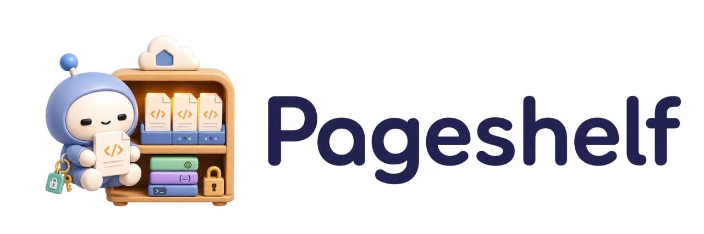

# pageshelf

<p align="center">
  
</p>

Pageshelf is a tiny, private, review-first artifact shelf for agent-generated HTML reports, plans, PR explainers, diagrams, annotated diffs, and interactive review pages.

[](https://github.com/upamune/pageshelf/actions/workflows/ci.yml?branch=main)
[](https://github.com/upamune/pageshelf/releases)
[](go.mod)
[](LICENSE)

- local-first Go CLI plus static web server
- clean `/a/...` artifact URLs for local/Tailscale private serving
- default localhost bind, private Tailscale sharing, and guarded public binds
- Markdown-to-HTML publishing, multi-file sessions, TTL metadata, and GC
- default-on interactive HTML with an injected mobile-first review/annotation runtime
- default-on Gitleaks scanning before artifacts are stored

## Install

### With mise

```bash
mise use -g github:upamune/pageshelf@latest
```

### From release binaries

Download a prebuilt binary for Linux, macOS, or Windows from the [latest GitHub Release](https://github.com/upamune/pageshelf/releases/latest).

### Build from source

```bash
go build -o pageshelf ./cmd/pageshelf
```

Requirements:

- Go 1.25+ to build from source
- Tailscale recommended for private network sharing
- Gitleaks is embedded through the Go dependency used by Pageshelf secret scanning

## Development

The HTML annotation UI is maintained as a small in-repo Vite/TypeScript web app at `internal/runtime/annotation` and managed with [aube](https://github.com/endevco/aube). Its source lives in `index.html`, `src/main.ts`, supporting `src/*.ts` modules, `src/light.css`, and `src/shadow.css`; Vite builds deterministic assets into `internal/runtime/annotation/dist/`, and the build script regenerates bundled Go asset constants in `internal/server/annotation_runtime_generated.go` so normal Go builds and CI do not need aube.

After changing the annotation web app, rebuild the dist assets and generated Go source with:

```bash
make runtime-build
```

That target runs `aube install`, `aube run build`, and `gofmt` for the generated `internal/server/annotation_runtime_generated.go` file.

## Quick start

```bash
pageshelf           # show help
pageshelf version   # print the installed version
pageshelf --version # same, for script-friendly checks
```

### Serve locally

```bash
pageshelf serve
```

By default, Pageshelf binds to:

```text
127.0.0.1:8787
```

### Publish an artifact

```bash
pageshelf put index.html
```

Typical output:

```text
session: 20260510-0924-artifact-7k3p
url: http://127.0.0.1:8787/a/20260510-0924-artifact-7k3p/index.html
```

### Share on a private tailnet

```bash
pageshelf serve --tailscale
pageshelf put --tailscale index.html
```

When an artifact intentionally embeds remote images, allow those image origins on the server:

```bash
pageshelf serve --tailscale --allow-image-src https://i.gyazo.com
```

With `--tailscale`, Pageshelf prefers MagicDNS when available and falls back to the raw Tailscale IP.

## Working with artifacts

Pageshelf is optimized for agent output that does not fit well in chat: long Markdown walls, dense tables, diagrams, code-review explainers, and review artifacts with mobile-first annotation affordances.

### Publish Markdown as HTML

Markdown is rendered to HTML by default:

```bash
pageshelf put research.md
```

`research.md` is stored and linked as `research.html`. Use `--raw` only when you want to serve Markdown itself:

```bash
pageshelf put --raw research.md
```

### Publish from stdin

```bash
cat report.html | pageshelf put --stdin --name index.html --tailscale
```

### Publish inline content

```bash
pageshelf put --content '<!doctype html><h1>Hello</h1>' --name index.html
```

### Add files to a session

```bash
pageshelf put --session pr-review index.html assets/
```

If `--session` is omitted, `put` creates a new session automatically.

### Publish interactive/review HTML

HTML artifacts are interactive by default; `--interactive` is kept only as a deprecated compatibility no-op. Pageshelf injects a lightweight, dependency-free annotation runtime into served HTML artifacts by default; use `--no-annotations` when creating or updating a session to opt out. The runtime uses a Shadow DOM panel for UI isolation, stores annotations in browser `localStorage` for the exact same-origin URL path, supports text selection and element picking, records quote/prefix/suffix/heading/path anchors, highlights restorable quotes with strongly prefixed light-DOM classes, and provides edit/delete/resolve controls plus **Copy annotations**, **Copy JSON**, and **Export JSON**. Treat same-origin artifact content in a session as trusted: other HTML served from the same origin/path scope can read same-origin browser storage. You can still generate pages with local JavaScript when it improves review: tabs, filters, custom copy buttons, or editors.

```bash
pageshelf put --tailscale index.html assets/
```

### Review and annotation UX

Pageshelf artifacts should be mobile-first review surfaces. For dense plans, diffs, and reports, prefer a selection-first review flow:

- readable single-column layout on phones, with sticky section navigation where useful
- tap/click targets for findings, checklist rows, and code/diff locations
- the built-in annotation/review panel that Pageshelf injects by default into served HTML artifacts
- a generic **Copy annotations** action that copies selected locations plus reviewer comments in plain text/Markdown
- **Copy JSON** / **Export JSON** for structured `pageshelf.annotations.v1` data when another tool should consume review notes
- local-only review state; no automatic sending to Hermes or any other agent, so pasted handoff is an explicit user action
- opt out with `pageshelf put --no-annotations ...` for artifacts that should receive a stricter no-script runtime policy

## Working with sessions

A session is a directory of files plus metadata.

```bash
pageshelf session create rate-limiter --tag backend --tag explainer --ttl 7d
pageshelf session info rate-limiter
pageshelf session meta rate-limiter --tag pr-review --ttl 14d
pageshelf files rate-limiter
pageshelf url --tailscale rate-limiter diagram.html
pageshelf gc --dry-run
```

Notes:

- Session IDs are safe slugs, usually auto-generated by `put`.
- New sessions default to `--ttl 14d`.
- Use `--ttl 0` for no automatic expiry.
- Use `--expires-at` for a fixed expiry timestamp or date.
- Tags can be set with `--tag` and replaced later with `session meta`.

## Working with agents

Pageshelf includes a Hermes-style skill for teaching agents the preferred artifact workflow.

```bash
pageshelf skill              # show skill command help
pageshelf skill show         # print embedded SKILL.md
pageshelf skill install dir  # write dir/SKILL.md
```

A good agent handoff looks like this:

```text
詳細HTML作った:
http://example.tailnet.ts.net:8787/a/.../index.html

中身:
- architecture diagram
- implementation plan
- risk checklist
```

Use Pageshelf when an agent should:

- create HTML instead of long Markdown
- publish artifacts through a private URL
- keep chat responses short
- avoid leaking secrets
- make review/annotation UI easy to use on mobile

## Using with Hermes Agent

Pageshelf is especially useful with [Hermes Agent](https://github.com/NousResearch/hermes-agent) on Telegram, Discord, Slack, or the terminal, where long Markdown plans and tables are hard to read. The pattern is simple: Hermes writes a rich HTML artifact, Pageshelf stores it, and the chat response stays short.

### Install the Pageshelf skill for Hermes

Pageshelf ships an embedded Hermes-compatible skill:

```bash
mkdir -p ~/.hermes/skills/devops/pageshelf
pageshelf skill install ~/.hermes/skills/devops/pageshelf
```

Then load it in a Hermes session when you want artifact-first output:

```text
/skill pageshelf
```

Or start Hermes with the skill preloaded:

```bash
hermes -s pageshelf
```

### Good Hermes use cases

- implementation plans with diagrams and code snippets
- PR explainers with annotated diffs
- research reports with sections, cards, and tables
- incident reports with timelines
- interactive tuning UIs with sliders, filters, or copy buttons

### Telegram-friendly handoff

Instead of making Hermes send a 300-line Markdown wall to Telegram, ask it to return a compact handoff:

```text
詳細HTML作った:
http://example.tailnet.ts.net:8787/a/.../index.html

要点:
- architecture and data flow are diagrammed
- risky parts are called out with severity labels
- implementation checklist is at the bottom
```

This keeps the messaging surface readable while the full artifact stays available in a browser.

### Hook-based automation

Hermes can also automate this with hooks: detect generated `.html` or long `.md` files after tool calls, publish them with Pageshelf, then replace long chat output with a short URL handoff.

Example shape:

```yaml
hooks:
  post_tool_call:
    - matcher: "write_file|patch|edit_file"
      command: "~/.hermes/hooks/pageshelf-artifact-hook.py"
      timeout: 60
```

A robust hook should:

- fail open if Pageshelf is unavailable
- skip `.git`, `.hermes`, `node_modules`, build directories, and secret-like dumps
- set an env guard such as `HERMES_DISABLE_ARTIFACT_HOOK=1` if it spawns another Hermes process
- use `pageshelf put --tailscale --json` so the URL and session can be parsed safely
- do not rely on automatic agent submission; keep annotation copy/paste explicit

Manual publishing is still the best starting point. Add hooks once the workflow is stable.

## Command reference

```bash
pageshelf serve [--tailscale] [--host HOST] [--port PORT] [--unsafe-public-bind]

pageshelf put [--session SESSION]
              [--stdin --name NAME | --content TEXT --name NAME | paths...]
              [--interactive]  # deprecated no-op; HTML is interactive by default
              [--no-annotations]
              [--raw]
              [--no-secret-scan]
              [--tag TAG]
              [--ttl 14d]
              [--expires-at RFC3339|YYYY-MM-DD]
              [--json]
              [--host HOST --port PORT | --tailscale | --base-url URL]

pageshelf session create [name] [--tag TAG] [--ttl 14d] [--expires-at RFC3339|YYYY-MM-DD] [--json]
pageshelf session info <session> [--json]
pageshelf session meta <session> [--tag TAG | --clear-tags] [--ttl DURATION | --expires-at RFC3339|YYYY-MM-DD] [--json]
pageshelf session rm <session>

pageshelf list [--json]
pageshelf files <session> [--json]
pageshelf url <session> [path] [--json] [--host HOST --port PORT | --tailscale | --base-url URL]
pageshelf gc [--dry-run] [--json]
pageshelf skill [help|show|install]
pageshelf version
```

Run `pageshelf <command> --help` for command-specific flags.

## Feature comparison

| Capability | pageshelf | raw Markdown in chat | GitHub Gist | S3/static hosting |
| --- | --- | --- | --- | --- |
| Rich HTML artifacts | ✅ | ❌ | ✅ | ✅ |
| Local-first storage | ✅ | ❌ | ❌ | ❌ |
| Private tailnet sharing | ✅ | ❌ | ❌ | ⚠️ |
| Clean local/Tailscale artifact URLs | ✅ | ❌ | ❌ | ⚠️ |
| Default-on secret scanning | ✅ | ❌ | ❌ | ❌ |
| TTL metadata and GC | ✅ | ❌ | ❌ | ⚠️ |
| Agent-oriented CLI workflow | ✅ | ⚠️ | ❌ | ❌ |
| Mobile-first review/annotation workflow | ✅ | ❌ | ⚠️ | ⚠️ |

Pageshelf is optimized for private agent-to-human artifact review, not long-lived public websites.

## Advanced

### Storage

Storage defaults to:

```text
~/.local/share/pageshelf
```

Override it with either:

```bash
pageshelf --data-dir ./tmp/pageshelf ...
PAGESHELF_DATA_DIR=./tmp/pageshelf pageshelf ...
```

### URL behavior

`put` returns the URL for the artifact it actually added:

- `pageshelf put foo.html` returns `/foo.html`
- `pageshelf put index.html` returns `/index.html`
- `pageshelf put report.md` returns `/report.html`
- `pageshelf put --raw report.md` returns `/report.md`
- multi-file uploads prefer `index.html` when present
- otherwise multi-file uploads return the first added file

Generate a URL later with:

```bash
pageshelf url 20260510-0924-artifact-7k3p
pageshelf url --tailscale 20260510-0924-artifact-7k3p diagram.html
pageshelf url --base-url http://agent-box:8787 20260510-0924-artifact-7k3p
```

### CSP for private interactive artifacts

Pageshelf assumes artifacts are self/agent-generated private review pages, but keeps network exfiltration blocked. The default CSP allows the injected inline annotation runtime and local assets only:

```http
default-src 'none'
script-src 'self' 'unsafe-inline'
style-src 'self' 'unsafe-inline'
img-src 'self' data: blob:
font-src 'self' data:
connect-src 'none'
object-src 'none'
base-uri 'none'
frame-ancestors 'none'
form-action 'none'
worker-src 'none'
child-src 'none'
frame-src 'none'
```

With `--no-annotations`, Pageshelf skips runtime injection and serves HTML with `script-src 'none'` and `connect-src 'none'`.

Use `pageshelf serve --allow-image-src <origin>` to append explicit remote image origins to `img-src`, for example `https://i.gyazo.com`. Values must be origins; paths, query strings, fragments, wildcards, whitespace, and semicolons are rejected. This only relaxes image loading. `connect-src 'none'` remains unchanged.

Artifact URLs are capability-free. Local/Tailscale-first serving, guarded public binds, path traversal prevention, symlink rejection, `no-store`, CSP, and secret scanning remain in place. Avoid remote CDNs and trackers unless explicitly allowed with `--allow-image-src`.

## Development

The default Make target is help:

```bash
make
```

Targets:

```bash
make fmt    # format with golangci-lint/gofumpt
make lint   # run golangci-lint, including revive
make test   # run go test ./...
make ci     # format check, lint, and tests
```

GitHub Actions runs the same quality gate on `main`. Workflow actions are SHA-pinned.

## Contributing

Issues and PRs are welcome. Keep changes small, run `make ci`, and preserve the local-first security model.

## License

[MIT](LICENSE) © 2026 Yu SERIZAWA
